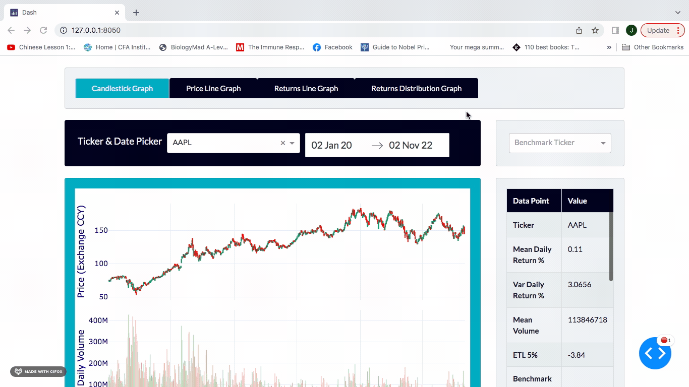
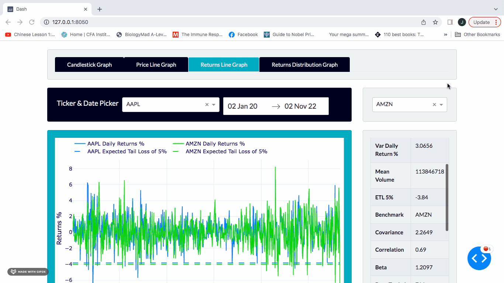

# stock-analysis-project

# Dash Web App - analysis

## Environment variables and running the app

Please find the <code>config.yaml</code> file in the **INSERT WHERE** folder in this repository.

Using the following 

***Steps*** [NEEDS WRITING]

* First create a folder locally where you wish for the project repository to be stored and run from
* Creating a virtual environment with the *config.yaml* file to replicate the package versions used in this project
* Clone repo from git locally
* Run the app.py file from the user's chosen IDE (if Jupyter notebook then be sure to convert the app.py file to 

### Project Structure
I used the following insightful resource to help understand how the project should be structured. I'm sure there could be improvements on the app layout and callback structure, so any suggestions from those with experience would be appreciated.

* **assets folder** > contains the static files. Currently it contains a static CSV file that stores stock price and volume data, as well as a Jupyter Notebook file (.ipynb) for downloading and generating the CSV file. in future it will also contain the css stylesheet once created.
* **components folder** > contains the html table code
* **utils folder** > contains the graph generations and calculation functions
* **app.py** > main executable file that stores the layout and complex callbacks used within the app

## Purpose
***The practical purpose:***
This project was to create myself a web application to assist in stock analysis when assessing long term stocks to invest in. Questions i wanted to address:
* When does volume and share price change? What events can these be attributed to?
* How inherently risky is the stock based on past performance? What's the volatility, Estimated Tail Loss and covariance when compared to other stocks?

***The fun purpose:*** 
This project was to delve into the designing and building of an app using the only scripting language I know, Python. It was also an exploration exercise asking what skills and potential job do I want to embark on next? Have I enjoyed the design elements more, the technical decision making or perhaps the thrill of something working? Also, do I now want to explore data more now that I can build ways to visualise and assess, or do I inherently prefer the building purpose and want to delve more into building scalable applications using other languages and tech stacks?

I've not answered all those questions, but have thoroughly enjoyed the experience and am keen to keep building. If you would like to collaborate, share ideas or code together then please reach out!

### Skills learnt
* **HTML/CSS/Bootstrap** - learning properties and relationships between elements within a web application
* **Dash** - building a complete web app in python
* **Plotly** - generating interactive graphs with custom and data driven features 
* **Pandas** - importing, filtering and transforming data to be displayed graphically. This included data type changes, calculations
* **Numpy** - for specific calculations on arrays

Where these skills can be used:
* **Data Analysis & Data Science** - it is imperative to convey and visualise data in an interpretable way, and even more impactful to convey this in an aesthetic way.
* **Product Management** - generating a prototype or MVP to convey ideas and test is a very powerful skill in the role. Also, understanding foundations behind data collection, transformation and data visualisation is extremely useful when it comes to assessing or deciding on business and product metrics to inform decisions taken by the product manager and how to convey these.
* **Software development** - debugging, testing and object principles all required deep thought within the project
* **Investment analysis** - understanding how to convey important metrics and tell a stock's story over time. This includes in relation to other stocks by using the benchmark features. Some important metrics are the mean volume, correlation, beta, and ETL 5% (estimated tail loss at 5%), which are all empirical metrics used within portfolio construction and risk analysis.

### Decisions
* In **calculation functions** Numpy was used for performing calculations on arrays because through testing at scale it was significantly quicker than the equivalent Pandas in-built calculation methods.
* **Data to be stored as CSV** for the time being instead of within a relational database suchs as PostrgeSQL. There are a couple of reasons behind this decision:
    * time taken to create a data integration whereby the database could be uploaded with more recent stock data which is alreay downloaded from the YFinanca API in Dataframe format.
    * In terms of sharing the project on Github, people can use the sample CSV data supplied and therefore use the web app immediately instead of requiring a database connection to a private one I would have otherwise created. 

### Outstanding bugs
* **Start and end date selection after a user interacts with the graph [HIGH]** - if a user drags across the graph, zooms in or out, or double clicks, then the start and end date pickers become inactive to the user unintentionally.

* **Start and end dates when a user's first graph action is to zoom out [MEDIUM]** - the start date and end date don't return to the minimum start date and maximum end date as defined in the callback, perhaps because the relayoutData hasn't been edited at that point, so the values returned are simply the start and end date. A workaround is simply double clicking the graph 

* **Ticker selection after selecting a benchmark ticker [LOW]** - once a benchmark ticker is selected then the user can select the same ticker in the primary ticker dropdown. This doesn't cause any Dash server errors so is a very minor UX bug. The principle is simply we prevent the benchmark ticker from being the same as the primary selected ticker, so why not vice versa. There is difficulty in applying this due to circular referencing within callbacks.

* **date picker height in relation to the ticker dropdown [LOW]** - it's not as simple as setting the individual component height in terms of pixels. It may be to do with the size of the text and potentially other aspects.

### Further areas for development

* **CSS stylesheet** - adding a css stylesheet for consistency across the app and for learning (because I have never created one)
* **App deployment using a tool like Heroku** - to deploy the app for others to use instead of running it up locally for my own sole usage. This would also allow for user feedback. 
* **Database creation insted of simple CSV storage locally** - to make the app's data storage more reliable and scalable if others were to use it then storing the data in a database and using select statements to select only necessary data for a user could be more lightweight and faster. 
* **Adding earnings values, float, outstanding shares and other metrics** - to get a more complete view on the company's performance and therefore potential reasons for stock performance, adding accounting data points and ratios would be required for the app to live out its true purpose. This data could easily be retrieved from YFinance API and could be stored in a database. The only difficulty is that YFinance uses quarterly references for quarterly earnings and I haven't so far seen a timestamp for when the values are released. This is important to expose because it has a tangible impact on the stock: i.e., real and not estimated earnings release date.
    * This incorporates corporate actions, some of which can be hard to represent such as stock splits and reverse stock splits where the price would have to be amended by the relevant factor.
* **Market/SEC restrictions**: there can be specific events such as short sale restrictions (alternative uptick rule) when the price experiences a 10% drop from the previous close price, or other general SEC filings revealing impactful information such as insiders altering their share ownership. 

